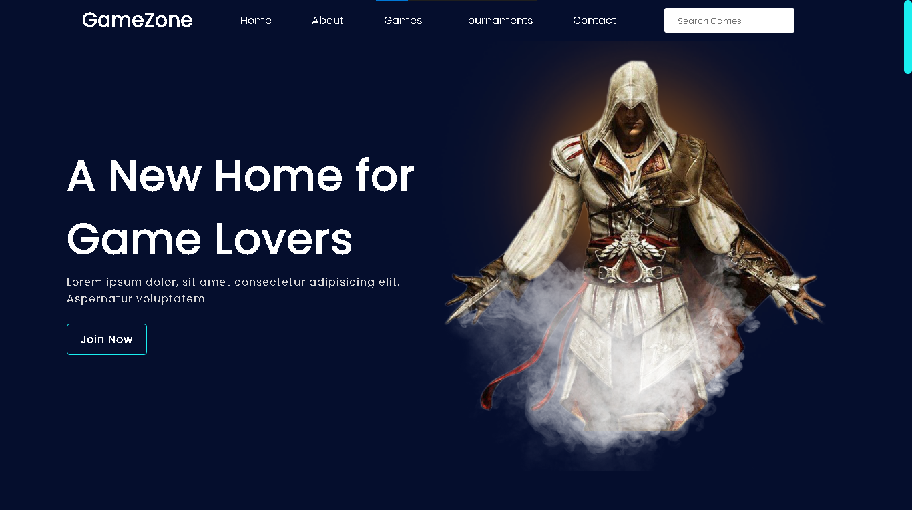
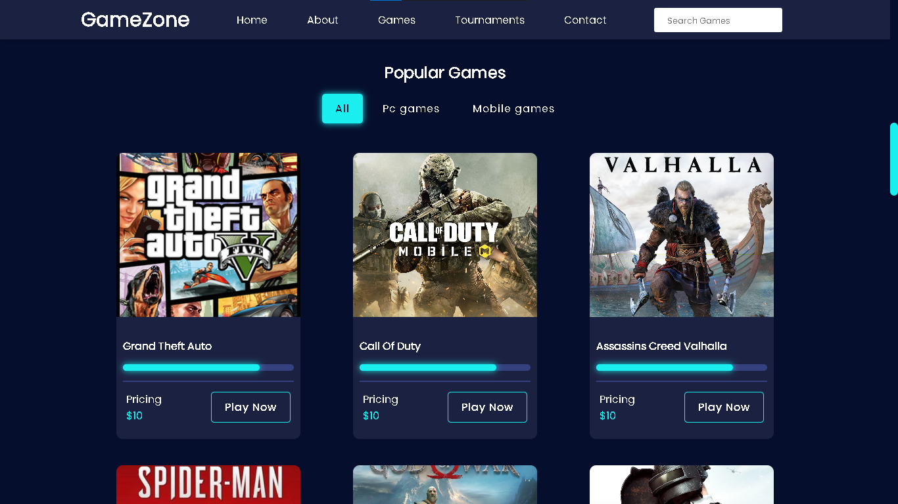
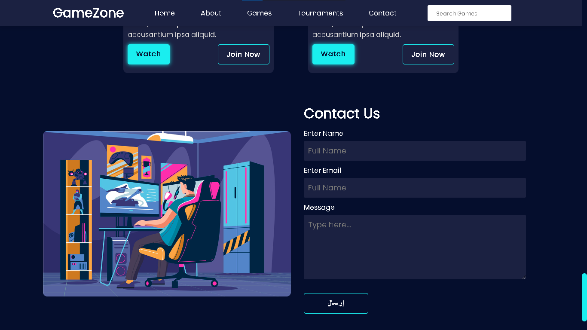

# 🎮 Gamezone

## Project Overview
Gamezone is a professional and feature-rich website dedicated to selling video games. Designed with a focus on user experience and functionality, it allows visitors to browse, explore categories, and purchase their favorite games effortlessly. The site leverages **HTML**, **CSS**, and **JavaScript** for optimal performance and responsive design.

---

## Features
- **Modern Design**: Sleek and intuitive interface tailored for gamers.
- **Game Categories**: Organize and browse games by genre, platform, or popularity.
- **Advanced Search Functionality**: Quickly locate desired games using keywords or filters.
- **Shopping Cart Management**: Add, update, or remove items seamlessly.
- **Responsive Design**: Fully optimized for desktops, tablets, and mobile devices.

---

## Technologies Used
- **HTML5**: Structuring the content and elements of the website.
- **CSS3**: Crafting a visually appealing and adaptive design.
- **JavaScript**: Powering interactivity and dynamic features.

---

## Website Screenshots

### Homepage


### Game Categories Page


### Contact Page


---

## Installation
1. Clone the repository to your local machine:
   ```bash
   git clone https://github.com/username/gamezone.git
   ```
2. Navigate to the project directory and open the `index.html` file in your preferred browser.

---

## Contributions
We highly value and encourage contributions to enhance the website. Here’s how you can contribute:
1. Fork the repository to your GitHub account.
2. Make improvements or add new features.
3. Open a pull request, describing the changes you’ve made.

---

## License
This project is licensed under the MIT License. See the LICENSE file for more details.

---

## Stay Connected
- Follow us on Instagram: [@CodeCraftDL](https://instagram.com/ddos_attack_co)
